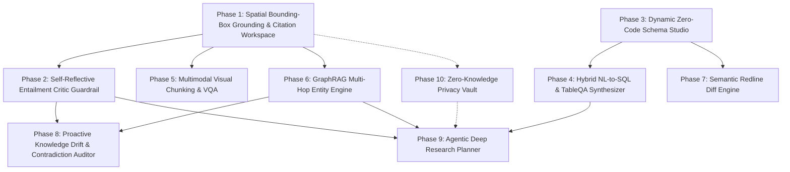

# KnowledgeForge AI — Next 10 Core Capabilities Implementation Plan

**Author:** Staff AI Systems Architect  
**Status:** Approved & Under Active Implementation  
**Sequence:** Priority Order (Phase 1 to Phase 10)

This plan outlines the architecture, database schema, data models, worker pipelines, API endpoints, and verification strategies for the 10 transformative platform capabilities.

---

## Strategic Dependency & Execution Graph

---

## 1. Feature Index & Priority Sequence

| # | Priority | Feature Name | Core Functionality | Primary Components |
|---|:---:|---|---|---|
| **1** | **Phase 1** | **Spatial Bounding-Box Grounding** | Precise pixel geometry `(page, x, y, w, h)` for all chunks, citations, and visual highlights | `ingestion/extract_pdf.py`, `ingestion/chunk.py`, `api.py` |
| **2** | **Phase 2** | **Self-Reflective Entailment Critic** | Active NLI verification pass eliminating hallucinated citations before delivery | `generation/verifier.py`, `generation/generate.py`, `api.py` |
| **3** | **Phase 3** | **Dynamic Schema Studio** | User-defined Pydantic & JSON Schema extraction at runtime without code changes | `extraction/dynamic_schemas.py`, `extraction/pipeline.py` |
| **4** | **Phase 4** | **Hybrid NL-to-SQL TableQA** | Mathematical aggregation and safe SQL generation over structured JSONB | `retrieval/table_qa.py`, `api.py` |
| **5** | **Phase 5** | **Multimodal Visual Chunking & VQA** | Native Gemini Vision reasoning over architecture diagrams, charts & figures | `ingestion/extract_visuals.py`, `generation/gemini.py` |
| **6** | **Phase 6** | **GraphRAG Multi-Hop Entity Engine** | Emergent Knowledge Graph in PostgreSQL with $N$-hop relational recursive CTEs | `extraction/graph_extractor.py`, `retrieval/graph_traversal.py` |
| **7** | **Phase 7** | **Semantic Redline Diff Engine** | Clause-by-clause version alignment, obligation drift, and risk delta scoring | `extraction/diff_engine.py`, `api_diff.py` |
| **8** | **Phase 8** | **Proactive Contradiction Auditor** | Asynchronous background sentinel identifying cross-document policy conflicts | `worker/auditor.py`, `admin_conflicts.py` |
| **9** | **Phase 9** | **Agentic Deep Research Planner** | Multi-round recursive query planner and executive dossier synthesizer | `generation/research_planner.py`, `research_routes.py` |
| **10** | **Phase 10** | **Zero-Knowledge Privacy Vault** | Cryptographic PII pseudonymization proxy before external LLM calls | `security/privacy_vault.py` |

---

## 2. Detailed Technical Specifications

### Phase 1: Spatial Bounding-Box Grounding & Citation Workspace
* **Goal:** Enable sub-page visual grounding. Chunks retain exact bounding polygon rectangles `[x0, y0, x1, y1]`.
* **Migration 025:** `025_spatial_bounding_boxes.sql` adds `bounding_boxes JSONB NOT NULL DEFAULT '[]'::jsonb` to `chunks`.
* **Ingestion:** `extract_pdf.py` captures page dimensions and word/line bounding boxes using `pdfplumber`/`pypdf`. `chunk.py` maps tokens to spatial bounding boxes.
* **API:** `/ask` and `/ask/stream` return `highlights: list[dict]` containing exact normalized box geometry `[x0, y0, x1, y1]` alongside page numbers.

### Phase 2: Self-Reflective Entailment Critic Guardrail
* **Goal:** Active real-time verification of LLM assertions against retrieved chunks.
* **Module:** `src/knowledgeforge/generation/verifier.py`.
* **Mechanism:** Decomposes answers into atomic claims. Each claim is evaluated against cited chunks using an NLI prompt with Gemini Flash (`ENTAILED`, `CONTRADICTED`, `UNVERIFIABLE`).
* **Enforcement:** Computes `grounding_score` ($0.0-1.0$). Contradicted assertions are filtered, corrected, or surfaced with warning badges.

### Phase 3: Dynamic Zero-Code Schema Studio
* **Goal:** Allow tenants to create and run arbitrary structured extraction schemas without redeploying code.
* **Migration 026:** `026_dynamic_schemas.sql` introduces `tenant_extraction_schemas`.
* **Module:** `src/knowledgeforge/extraction/dynamic_schemas.py`.
* **Mechanism:** Accepts JSON Schema or natural language descriptions. Compiles schemas dynamically into Pydantic models at runtime (`create_model`). The extraction worker dynamically validates and populates `document_extractions`.

### Phase 4: Hybrid NL-to-SQL TableQA Synthesizer
* **Goal:** Execute quantitative and aggregation queries (*"What was our total software spend across 2025 vendor contracts?"*).
* **Module:** `src/knowledgeforge/retrieval/table_qa.py`.
* **Mechanism:** Intent classifier identifies analytical queries. Generates parameterized SQL queries over Postgres JSONB (`document_extractions.fields`), enforcing tenant isolation (`tenant_id = %s`). Synthesizes computed numbers with cited narrative text.

### Phase 5: Multimodal Visual Chunking & VQA
* **Goal:** Extract, embed, and reason directly over visual diagrams, charts, and figures.
* **Migration 027:** `027_visual_chunks.sql` adds `modality` (`text` vs. `image`) and `image_storage_uri` to `chunks`.
* **Ingestion:** `extract_visuals.py` detects images and high-density drawing figures in PDFs, saves crops as WebP, and stores in GCS.
* **Generation:** `generation/gemini.py` supports multimodal parts in ask prompts for visual reasoning.

### Phase 6: GraphRAG Multi-Hop Entity Engine
* **Goal:** Enable multi-hop entity reasoning across interconnected documents.
* **Migration 028:** `028_knowledge_graph.sql` creates `graph_entities` and `graph_relationships`.
* **Extraction:** Ingestion worker extracts named entity triples `(Entity A)-[RELATION]->(Entity B)`.
* **Retrieval:** `retrieval/graph_traversal.py` uses PostgreSQL Recursive CTEs to explore $N$-hop relational neighborhoods and injects subgraphs into generation prompts.

### Phase 7: Semantic Redline Diff Engine
* **Goal:** Deep semantic comparison between two document revisions or competing contracts.
* **Module:** `src/knowledgeforge/extraction/diff_engine.py`.
* **Mechanism:** Matches clauses across documents using pgvector semantic similarity. Identifies additions, deletions, covenant modifications, and liability alterations with risk delta scores (`HIGH`, `MEDIUM`, `LOW`).

### Phase 8: Proactive Knowledge Drift & Contradiction Auditor
* **Goal:** Background sentinel continuously auditing corpus consistency.
* **Migration 029:** `029_knowledge_conflicts.sql` creates `knowledge_conflicts`.
* **Worker:** `worker/auditor.py` compares newly ingested documents against semantically overlapping older documents to detect direct factual, procedural, or date contradictions.

### Phase 9: Agentic Deep Research Planner
* **Goal:** Autonomous multi-round investigation agent for complex analytical briefs.
* **Migration 030:** `030_research_jobs.sql` creates `research_jobs`.
* **Module:** `generation/research_planner.py`.
* **Mechanism:** Decomposes complex briefs into execution plans, issues iterative queries across vector, graph, and SQL engines, identifies missing evidence, and compiles comprehensive research dossiers.

### Phase 10: Zero-Knowledge Privacy Vault
* **Goal:** Cryptographic PII/PHI protection ensuring no raw sensitive identifiers reach LLMs.
* **Migration 031:** `031_privacy_vault.sql` creates `pseudonym_vault`.
* **Module:** `security/privacy_vault.py`.
* **Mechanism:** In-line pseudonymization replaces sensitive entities with deterministic tokens (e.g., `[PERSON_7a4f]`). Secure re-hydration runs on response delivery only for authorized users.
